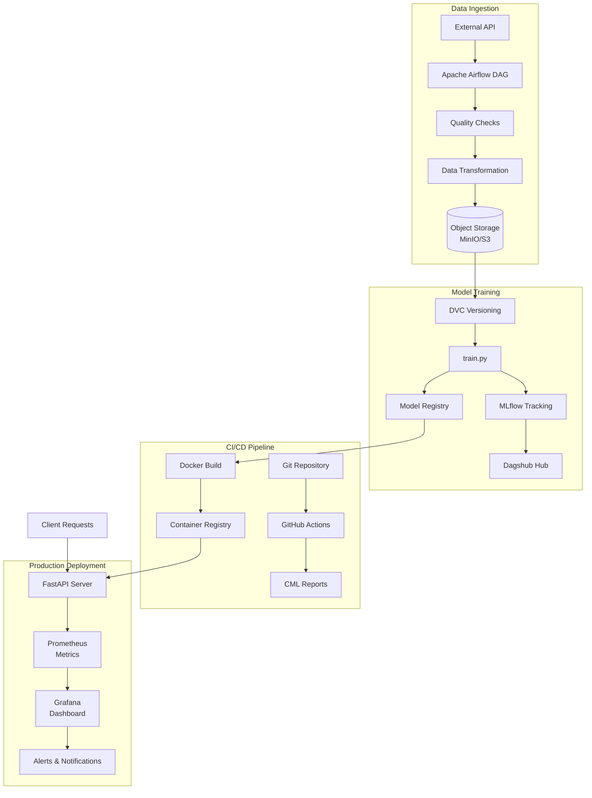
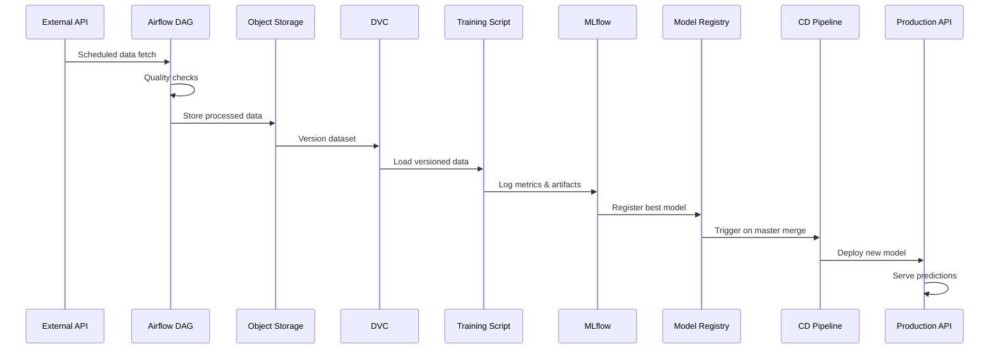
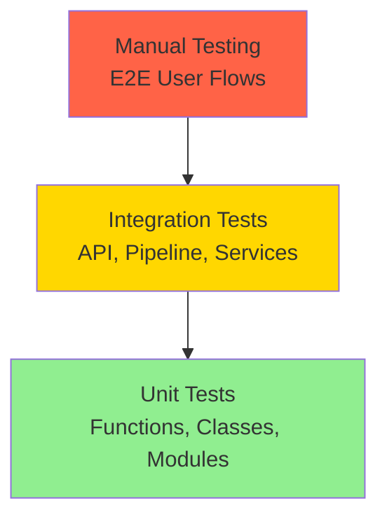

# MLOps Real-Time Predictive System (RPS) - Project Specifications

**Project Deadline:** November 30, 2025  
**Document Version:** 1.0  
**Last Updated:** November 30, 2025

---

## Executive Summary

This project involves developing a comprehensive **Real-Time Predictive System (RPS)** that demonstrates advanced MLOps practices including automated data ingestion, continuous model training, deployment automation, and production monitoring. The system will process live data streams, automatically detect and adapt to concept drift, and serve predictions through a containerized REST API with full observability.

### Key Objectives

- Build an end-to-end MLOps pipeline with full automation
- Implement robust CI/CD practices with automated testing and deployment
- Demonstrate production-grade monitoring and alerting capabilities
- Integrate industry-standard tools (Airflow, MLflow, DVC, Docker, Prometheus, Grafana)
- Create a scalable, maintainable system architecture

---

## 1. Project Overview & Context

### 1.1 Problem Statement

Modern machine learning systems require continuous adaptation to changing data patterns. This project moves beyond static, periodically trained models to create a robust, automated, and continuously monitored Real-Time Predictive System that:

- Handles live data streams from external APIs
- Automatically adapts to concept drift
- Maintains production-grade reliability and observability
- Follows MLOps best practices throughout the ML lifecycle

### 1.2 Core Requirements

The deliverable is a **fully integrated MLOps pipeline** that:

- ✅ Trains models automatically on fresh data
- ✅ Serves predictions via REST API
- ✅ Monitors model and system performance
- ✅ Operates in a production-like environment
- ✅ Implements version control for code, data, and models

### 1.3 Technology Stack

| Category                  | Tools                       | Purpose                                                 |
| ------------------------- | --------------------------- | ------------------------------------------------------- |
| **Orchestration**         | Apache Airflow              | Schedule and automate ETL → Training workflow           |
| **Data/Model Management** | DVC, MLflow, Dagshub        | Version data, track experiments, centralize artifacts   |
| **CI/CD**                 | GitHub Actions, CML, Docker | Automate testing, model comparison, deployment          |
| **Monitoring**            | Prometheus, Grafana         | Collect metrics, visualize performance, alert on issues |

---

## 2. Phase I: Problem Definition and Data Ingestion

### 2.1 Problem Domain Selection

**Requirement:** Select one predictive challenge centered around time-series data from a free, live external API.

#### Available Domains & APIs

| Domain            | Example Free APIs          | Predictive Task                                                                                          |
| ----------------- | -------------------------- | -------------------------------------------------------------------------------------------------------- |
| **Financial**     | Alpha Vantage, Twelve Data | Stock/Crypto Volatility: Predict short-term volatility or closing price for specific asset (next hour)   |
| **Environmental** | OpenWeatherMap             | Localized Forecasting: Predict key weather variable (temperature, wind speed) for a city 4-6 hours ahead |
| **Logistics**     | Public Transit Data        | ETA/Delay: Predict delay or arrival time of specific transit vehicle at future stop                      |

**Deliverables:**

- Selected domain with justification
- API access credentials and documentation
- Initial data exploration report

---

### 2.2 Orchestration Core: Apache Airflow

**Requirement:** Build a Directed Acyclic Graph (DAG) in Apache Airflow for the complete ETL and model retraining lifecycle.

#### 2.2.1 DAG Scheduling

- **Schedule:** Daily execution (configurable)
- **Responsibility:** Complete ETL pipeline and model retraining
- **Failure Handling:** Automatic alerting on DAG failures

#### 2.2.2 Extraction (Step 2.1)

**Implementation Requirements:**

- Use Python operator to connect to selected API
- Fetch latest live data
- Save raw data immediately with collection timestamp
- Store in structured format (e.g., `raw_data_YYYYMMDD_HHMMSS.csv`)

**Mandatory Quality Gate:**

```python
# Data Quality Check Requirements
- Check for >1% null values in key columns
- Schema validation against expected structure
- Data freshness verification
- Record count validation

# Failure Behavior
- If quality check fails → DAG must fail and stop
- Log detailed error information
- Trigger alert notification
```

**Deliverables:**

- Extraction Python script
- Data quality validation module
- Raw data storage structure
- Error handling and logging

---

#### 2.2.3 Transformation (Step 2.2)

**Implementation Requirements:**

- Clean raw data (handle nulls, outliers, duplicates)
- Essential feature engineering for time-series:
  - Lag features (e.g., previous 1h, 3h, 24h values)
  - Rolling statistics (mean, std, min, max)
  - Time-based features (hour, day of week, month)
  - Domain-specific features

**Documentation Artifact:**

- Generate data quality report using **Pandas Profiling** or similar
- Include:
  - Feature distributions
  - Correlation analysis
  - Missing value patterns
  - Statistical summaries
- **Log report as artifact to MLflow Tracking Server (Dagshub)**

**Deliverables:**

- Transformation pipeline script
- Feature engineering module
- Data quality report (HTML/PDF)
- MLflow artifact logging

---

#### 2.2.4 Loading & Versioning (Steps 2.3 & 3)

**Cloud-like Object Storage:**

- Store final processed dataset in:
  - MinIO (recommended for local development)
  - AWS S3
  - Azure Blob Storage
  - Google Cloud Storage

**Data Version Control (DVC):**

```bash
# DVC Workflow
1. Process and save dataset to storage
2. Track with DVC: dvc add data/processed/dataset.csv
3. Commit .dvc metadata file to Git
4. Push large dataset to remote storage: dvc push
```

**Requirements:**

- `.dvc` metadata files committed to Git
- Large dataset files pushed to remote storage
- Versioning aligned with model versions
- Automated DVC operations in Airflow DAG

**Deliverables:**

- DVC configuration files
- Remote storage setup documentation
- Automated versioning in DAG
- Data lineage tracking

---

## 3. Phase II: Experimentation and Model Management

### 3.1 MLflow & Dagshub Integration (Step 4)

**Architecture:** Airflow DAG triggers `train.py` → MLflow tracks experiments → Dagshub centralizes artifacts

#### 3.1.1 MLflow Tracking Requirements

**Within training script (`train.py`):**

```python
import mlflow

# Track ALL experiment runs
- Hyperparameters (learning rate, model architecture, etc.)
- Training configuration (batch size, epochs, optimizer)
- Key metrics (RMSE, MAE, R-squared, custom metrics)
- Model artifacts (trained model, preprocessing pipeline)
- Training metadata (duration, data version, code version)
```

**Metrics to Track:**

- **Regression Tasks:** RMSE, MAE, R², MAPE
- **Classification Tasks:** Accuracy, Precision, Recall, F1, AUC-ROC
- **Time-Series Specific:** Forecast skill score, directional accuracy
- **Custom Metrics:** Domain-specific performance measures

**Deliverables:**

- Training script with comprehensive MLflow logging
- Experiment tracking configuration
- Model artifact structure
- Hyperparameter tuning pipeline

---

#### 3.1.2 Dagshub as Central Hub

**Configuration Requirements:**

```bash
# Dagshub Integration
- Remote MLflow Tracking Server URL
- DVC remote storage configuration
- Authentication credentials
```

**Dagshub provides unified view of:**

1. **Code (Git):** Version control and collaboration
2. **Data (DVC):** Dataset versions and lineage
3. **Models/Experiments (MLflow):** Training runs and artifacts

**Benefits:**

- Single collaborative UI for entire team
- Experiment comparison and visualization
- Model registry and deployment tracking
- Data and code provenance

**Deliverables:**

- Dagshub repository setup
- MLflow tracking server configuration
- DVC remote storage integration
- Team access and permissions

---

## 4. Phase III: Continuous Integration & Deployment (CI/CD)

### 4.1 Git Workflow and Branching Strategy (Step 5)

#### 4.1.1 Strict Branching Model

```mermaid
gitGraph
    commit id: "Initial"
    branch dev
    checkout dev
    commit id: "Feature 1"
    branch feature/data-pipeline
    checkout feature/data-pipeline
    commit id: "Add API extraction"
    commit id: "Add quality checks"
    checkout dev
    merge feature/data-pipeline
    branch test
    checkout test
    merge dev
    commit id: "Integration tests"
    checkout main
    merge test tag: "v1.0.0"
```

**Branch Structure:**

- **`master` (main):** Production-ready code only
- **`test`:** Integration and staging environment
- **`dev`:** Development integration branch
- **`feature/*`:** Individual feature development

**Workflow Rules:**

1. All new work starts on `feature/*` branches
2. Features merge into `dev` via Pull Request
3. `dev` merges into `test` after code review
4. `test` merges into `master` after successful validation
5. No direct commits to `test` or `master`

---

#### 4.1.2 Pull Request Requirements

**Mandatory PR Approvals:**

- At least **1 peer review** required for `test` merges
- At least **1 peer review** required for `master` merges
- All CI checks must pass before merge
- CML reports must show improvement (for model changes)

**PR Checklist:**

- [ ] Code follows project style guidelines
- [ ] Tests added/updated for new functionality
- [ ] Documentation updated
- [ ] No merge conflicts
- [ ] CI pipeline passes
- [ ] Performance metrics meet thresholds

---

### 4.2 GitHub Actions with CML

#### 4.2.1 CI/CD Workflow by Branch

| Merge Event       | CI Action                                                    | CML Integration                                                                                                  |
| ----------------- | ------------------------------------------------------------ | ---------------------------------------------------------------------------------------------------------------- |
| **Feature → dev** | Run code quality checks (linting) and unit tests             | N/A                                                                                                              |
| **dev → test**    | Model retraining test: Trigger Airflow DAG for full pipeline | Generate metric comparison report comparing new model vs. production model. Block merge if performance degrades. |
| **test → master** | Full production deployment pipeline                          | N/A                                                                                                              |

---

#### 4.2.2 GitHub Actions Configuration

**`.github/workflows/ci-cd.yml` structure:**

```yaml
# Feature → dev workflow
name: Code Quality & Unit Tests
on:
  pull_request:
    branches: [dev]
jobs:
  quality-checks:
    - Linting (flake8, black, isort)
    - Type checking (mypy)
    - Unit tests (pytest)
    - Code coverage report

# dev → test workflow
name: Model Training & Validation
on:
  pull_request:
    branches: [test]
jobs:
  model-validation:
    - Trigger Airflow DAG
    - Run full ETL + training pipeline
    - Generate CML report
    - Compare metrics vs. production
    - Block merge if performance drops

# test → master workflow
name: Production Deployment
on:
  pull_request:
    branches: [master]
jobs:
  deploy-production:
    - Fetch best model from MLflow Registry
    - Build Docker image
    - Push to container registry
    - Deploy and verify
```

**Deliverables:**

- Complete GitHub Actions workflow files
- CML report generation scripts
- Automated testing suite
- Deployment automation scripts

---

### 4.3 Containerization and Deployment (Steps 5.4 & 5.5)

#### 4.3.1 Docker Containerization

**Requirements:**

- Model served via **REST API** using:
  - FastAPI (recommended) or Flask
  - Pydantic for request/response validation
  - Proper error handling and logging

**Dockerfile Structure:**

```dockerfile
FROM python:3.9-slim

WORKDIR /app

# Install dependencies
COPY requirements.txt .
RUN pip install --no-cache-dir -r requirements.txt

# Copy application code
COPY app/ ./app/
COPY models/ ./models/

# Expose API port
EXPOSE 8000

# Health check
HEALTHCHECK --interval=30s --timeout=3s \
  CMD curl -f http://localhost:8000/health || exit 1

# Run application
CMD ["uvicorn", "app.main:app", "--host", "0.0.0.0", "--port", "8000"]
```

**API Endpoints Required:**

```python
# Minimum API endpoints
GET  /health          # Health check endpoint
GET  /metrics         # Prometheus metrics
POST /predict         # Prediction endpoint
GET  /model/info      # Model metadata
```

**Deliverables:**

- Dockerfile and .dockerignore
- FastAPI application code
- API documentation (Swagger/OpenAPI)
- Container build scripts

---

#### 4.3.2 Continuous Delivery Pipeline

**Trigger:** Merge from `test` → `master`

**CD Steps:**

1. **Fetch Model:**

   ```python
   # From MLflow Model Registry
   - Get production-tagged model
   - Download model artifacts
   - Verify model integrity
   ```

2. **Build Docker Image:**

   ```bash
   docker build -t rps-predictor:v1.0.0 .
   docker tag rps-predictor:v1.0.0 username/rps-predictor:latest
   ```

3. **Push to Container Registry:**

   ```bash
   # Docker Hub or private registry
   docker push username/rps-predictor:v1.0.0
   docker push username/rps-predictor:latest
   ```

4. **Deployment Verification:**

   ```bash
   # Run container locally or on staging
   docker run -d -p 8000:8000 username/rps-predictor:v1.0.0

   # Health check verification
   curl http://localhost:8000/health

   # Test prediction
   curl -X POST http://localhost:8000/predict \
     -H "Content-Type: application/json" \
     -d '{"features": [...]}'
   ```

**Deliverables:**

- Automated CD pipeline
- Container registry configuration
- Deployment verification scripts
- Rollback procedures

---

## 5. Phase IV: Monitoring and Observability

### 5.1 Prometheus Integration

**Requirements:** Embed Prometheus data collector within FastAPI prediction server

#### 5.1.1 Service Metrics

**Required Metrics:**

```python
from prometheus_client import Counter, Histogram, Gauge

# Request metrics
request_count = Counter('api_requests_total', 'Total API requests')
request_latency = Histogram('api_request_latency_seconds',
                           'API request latency in seconds')

# Prediction metrics
prediction_count = Counter('predictions_total', 'Total predictions made')
prediction_errors = Counter('prediction_errors_total', 'Prediction errors')

# Service health
service_uptime = Gauge('service_uptime_seconds', 'Service uptime')
```

**Endpoint:** `/metrics` (Prometheus scrape target)

---

#### 5.1.2 Model/Data Drift Metrics

**Custom Drift Metrics:**

```python
# Data drift indicators
ood_ratio = Gauge('out_of_distribution_ratio',
                  'Ratio of OOD feature values')
feature_mean_shift = Gauge('feature_mean_shift',
                          'Mean shift from training distribution',
                          ['feature_name'])

# Model performance drift
prediction_variance = Gauge('prediction_variance',
                           'Variance in predictions')
confidence_distribution = Histogram('prediction_confidence',
                                   'Distribution of prediction confidence')
```

**Drift Detection Logic:**

- Compare incoming feature distributions vs. training data
- Flag requests with features outside training range
- Calculate distribution similarity metrics (KL divergence, KS test)

**Deliverables:**

- Prometheus client integration
- Custom metrics definitions
- Drift detection algorithms
- Metrics export configuration

---

### 5.2 Grafana Dashboard & Alerting

#### 5.2.1 Grafana Setup

**Requirements:**

1. Deploy Grafana instance
2. Connect to Prometheus data source
3. Create real-time monitoring dashboard

**Dashboard Components:**

```markdown
## Service Health Panel

- API request rate (requests/min)
- Average response latency
- Error rate percentage
- Service uptime

## Model Performance Panel

- Prediction throughput
- Prediction confidence distribution
- OOD detection rate
- Feature drift indicators

## Infrastructure Panel

- Container resource usage (CPU, memory)
- Network I/O
- Disk usage
```

---

#### 5.2.2 Alerting Configuration

**Alert Rules:**

1. **High Latency Alert**

   ```yaml
   Alert: InferenceLatencyHigh
   Condition: avg(api_request_latency_seconds) > 0.5
   Duration: 5m
   Severity: Warning
   Action: Slack notification / Email / Log to file
   ```

2. **Data Drift Alert**

   ```yaml
   Alert: DataDriftDetected
   Condition: out_of_distribution_ratio > 0.15
   Duration: 10m
   Severity: Critical
   Action: Slack notification + trigger retraining
   ```

3. **Service Down Alert**
   ```yaml
   Alert: ServiceUnhealthy
   Condition: up{job="rps-predictor"} == 0
   Duration: 2m
   Severity: Critical
   Action: Immediate notification
   ```

**Notification Channels:**

- Slack integration (recommended)
- Email alerts
- File logging
- Webhook integration

**Deliverables:**

- Grafana dashboard JSON
- Alert rule configurations
- Notification channel setup
- Runbook for common alerts

---

## 6. System Architecture

### 6.1 Overall Architecture Diagram



---

### 6.2 Data Flow Diagram



---

## 7. Implementation Checklist

### 7.1 Phase I Deliverables

- [ ] Domain selection and API access setup
- [ ] Airflow installation and configuration
- [ ] DAG implementation:
  - [ ] Data extraction operator
  - [ ] Quality check gate
  - [ ] Transformation pipeline
  - [ ] Storage integration
- [ ] DVC setup and configuration
- [ ] Object storage setup (MinIO/S3)
- [ ] Data quality reporting (Pandas Profiling)
- [ ] MLflow artifact logging

---

### 7.2 Phase II Deliverables

- [ ] Dagshub repository setup
- [ ] MLflow tracking server configuration
- [ ] Training script (`train.py`) with:
  - [ ] Hyperparameter logging
  - [ ] Metric tracking
  - [ ] Model artifact saving
  - [ ] Data version tracking
- [ ] Model Registry setup
- [ ] Experiment comparison dashboard

---

### 7.3 Phase III Deliverables

- [ ] Git repository with branch structure
- [ ] GitHub Actions workflows:
  - [ ] Feature → dev (linting, unit tests)
  - [ ] dev → test (model training, CML)
  - [ ] test → master (deployment)
- [ ] CML integration and reporting
- [ ] Docker containerization:
  - [ ] Dockerfile
  - [ ] FastAPI application
  - [ ] API endpoints
  - [ ] Health checks
- [ ] Container registry setup
- [ ] Automated deployment pipeline

---

### 7.4 Phase IV Deliverables

- [ ] Prometheus integration:
  - [ ] Service metrics
  - [ ] Custom drift metrics
  - [ ] Metrics endpoint
- [ ] Grafana setup:
  - [ ] Dashboard creation
  - [ ] Panel configuration
  - [ ] Data source connection
- [ ] Alert configuration:
  - [ ] Latency alerts
  - [ ] Drift alerts
  - [ ] Service health alerts
- [ ] Notification channel setup
- [ ] Alert runbook documentation

---

## 8. Success Criteria

### 8.1 Functional Requirements

✅ **Data Pipeline:**

- Automated daily data ingestion from external API
- Quality checks prevent bad data from entering pipeline
- Feature engineering produces relevant time-series features
- Data versioning tracks all dataset changes

✅ **Model Training:**

- Automated retraining on fresh data
- All experiments tracked in MLflow
- Best model automatically registered
- Performance metrics exceed baseline thresholds

✅ **CI/CD Pipeline:**

- All merges follow branching strategy
- Automated testing catches regressions
- CML prevents deployment of worse models
- Production deployments are fully automated

✅ **Production Deployment:**

- Model serves predictions via REST API
- API is containerized and reproducible
- Health checks confirm service availability
- Deployment verification is automated

✅ **Monitoring:**

- Real-time metrics collection
- Drift detection alerts trigger
- Dashboards visualize system health
- Alerts notify team of issues

---

### 8.2 Non-Functional Requirements

**Performance:**

- API latency < 500ms (95th percentile)
- Data processing completes within schedule window
- Model training completes within reasonable time (<2 hours)

**Reliability:**

- System uptime > 99%
- Automated failure recovery
- Data quality checks prevent corrupt data
- Graceful degradation on API failures

**Scalability:**

- Pipeline handles increasing data volumes
- API can scale horizontally
- Storage can accommodate growth
- Monitoring scales with system

**Maintainability:**

- Code follows style guidelines
- Documentation is comprehensive
- Configuration is externalized
- Logging provides debugging context

**Security:**

- API credentials securely managed
- Container images scanned for vulnerabilities
- Access controls on model registry
- Sensitive data properly handled

---

## 9. Technical Specifications

### 9.1 Development Environment

**Required Software:**

```yaml
Core Tools:
  - Python: 3.9+
  - Docker: 20.10+
  - Git: 2.30+

Python Packages:
  - apache-airflow: 2.5+
  - mlflow: 2.0+
  - dvc: 2.0+
  - fastapi: 0.95+
  - prometheus-client: 0.16+
  - pandas: 1.5+
  - numpy: 1.23+
  - scikit-learn: 1.2+
  - pytest: 7.0+

Infrastructure:
  - MinIO/AWS S3
  - Prometheus: 2.40+
  - Grafana: 9.0+
```

---

### 9.2 Project Structure

```
rps-mlops-project/
├── .github/
│   └── workflows/
│       ├── ci-dev.yml
│       ├── ci-test.yml
│       └── cd-production.yml
├── airflow/
│   ├── dags/
│   │   └── rps_pipeline_dag.py
│   ├── plugins/
│   └── config/
├── data/
│   ├── raw/
│   ├── processed/
│   └── .gitignore
├── models/
│   ├── train.py
│   ├── evaluate.py
│   └── predict.py
├── api/
│   ├── app/
│   │   ├── main.py
│   │   ├── models.py
│   │   └── routers/
│   ├── Dockerfile
│   └── requirements.txt
├── monitoring/
│   ├── prometheus/
│   │   └── prometheus.yml
│   └── grafana/
│       ├── dashboards/
│       └── provisioning/
├── tests/
│   ├── unit/
│   ├── integration/
│   └── conftest.py
├── notebooks/
│   └── exploration/
├── docs/
│   ├── API.md
│   ├── DEPLOYMENT.md
│   └── MONITORING.md
├── .dvc/
├── .dvcignore
├── dvc.yaml
├── params.yaml
├── requirements.txt
├── README.md
└── docker-compose.yml
```

---

## 10. Timeline and Milestones

### Recommended Project Schedule

**Week 1-2: Foundation Setup**

- [ ] Environment setup and tool installation
- [ ] Domain selection and API exploration
- [ ] Initial Airflow DAG development
- [ ] Data ingestion and quality checks

**Week 3-4: Core Pipeline Development**

- [ ] Complete ETL pipeline
- [ ] DVC and MLflow integration
- [ ] Training script development
- [ ] Experiment tracking setup

**Week 5-6: CI/CD Implementation**

- [ ] Git workflow and branching setup
- [ ] GitHub Actions configuration
- [ ] CML integration
- [ ] Docker containerization

**Week 7-8: Deployment and Monitoring**

- [ ] FastAPI development
- [ ] Container deployment
- [ ] Prometheus integration
- [ ] Grafana dashboard creation

**Deadline: November 30, 2025**

---

## 11. Documentation Requirements

### 11.1 Project Documentation

**README.md:**

- Project overview and objectives
- Quick start guide
- Installation instructions
- Usage examples

**API Documentation:**

- Endpoint specifications
- Request/response schemas
- Authentication details
- Example requests

**Deployment Guide:**

- Infrastructure requirements
- Configuration steps
- Container deployment
- Troubleshooting

**Monitoring Guide:**

- Dashboard descriptions
- Alert explanations
- Metrics definitions
- Response procedures

---

### 11.2 Code Documentation

**Requirements:**

- Docstrings for all functions and classes
- Inline comments for complex logic
- Type hints for function signatures
- Configuration file documentation

**Example:**

```python
def extract_features(
    df: pd.DataFrame,
    lag_periods: List[int] = [1, 3, 24]
) -> pd.DataFrame:
    """
    Create time-series features from raw data.

    Args:
        df: Raw time-series data with datetime index
        lag_periods: List of lag periods for feature creation

    Returns:
        DataFrame with engineered features

    Raises:
        ValueError: If df is missing required columns
    """
    # Implementation
```

---

## 12. Testing Strategy

### 12.1 Testing Pyramid



### 12.2 Test Categories

**Unit Tests (70% coverage minimum):**

- Data transformation functions
- Feature engineering logic
- Model training utilities
- API endpoint handlers

**Integration Tests:**

- Airflow DAG execution
- MLflow tracking workflow
- API with model predictions
- Prometheus metrics collection

**System Tests:**

- Complete pipeline end-to-end
- Docker container functionality
- Monitoring and alerting
- Deployment verification

---

## 13. Risk Management

### 13.1 Identified Risks

| Risk                          | Impact | Mitigation                              |
| ----------------------------- | ------ | --------------------------------------- |
| API rate limiting             | High   | Implement caching, backoff strategies   |
| Data quality issues           | High   | Strict validation, automated checks     |
| Model performance degradation | Medium | CML blocking, automated retraining      |
| Infrastructure failures       | Medium | Health checks, automated recovery       |
| Deployment failures           | Medium | Automated rollback, staging environment |

### 13.2 Contingency Plans

**API Unavailability:**

- Fallback to cached/historical data
- Alert team for manual intervention
- Error logging and monitoring

**Model Performance Drop:**

- Block deployment via CML
- Investigate root cause
- Retrain with different configurations

**Production Service Failure:**

- Automated container restart
- Rollback to previous version
- Incident response protocol

---

## 14. Evaluation Criteria

### 14.1 Assessment Matrix

**Tool Integration (30%):**

- Proper setup of all required tools
- Correct configuration and connectivity
- Seamless data flow between components

**Automation (25%):**

- End-to-end pipeline automation
- CI/CD workflow completeness
- Minimal manual intervention required

**Code Quality (20%):**

- Clean, maintainable code
- Comprehensive testing
- Documentation completeness
- Adherence to best practices

**Monitoring & Observability (15%):**

- Metrics collection and visualization
- Alert configuration and functionality
- Dashboard usability and insights

**Project Presentation (10%):**

- Clear demonstration of working system
- Understanding of architecture
- Ability to explain design decisions
- Documentation quality

---

## 15. Resources and References

### 15.1 Official Documentation

- **Apache Airflow:** https://airflow.apache.org/docs/
- **MLflow:** https://mlflow.org/docs/latest/index.html
- **DVC:** https://dvc.org/doc
- **FastAPI:** https://fastapi.tiangolo.com/
- **Prometheus:** https://prometheus.io/docs/
- **Grafana:** https://grafana.com/docs/
- **Docker:** https://docs.docker.com/
- **GitHub Actions:** https://docs.github.com/en/actions
- **CML:** https://cml.dev/doc

### 15.2 Tutorials and Examples

- MLOps Best Practices: https://ml-ops.org/
- DVC + MLflow Integration: https://dvc.org/doc/use-cases/versioning-data-and-model-files
- FastAPI + Prometheus: https://github.com/trallnag/prometheus-fastapi-instrumentator
- Grafana Alerting: https://grafana.com/docs/grafana/latest/alerting/

---

## 16. Appendix

### 16.1 Glossary

**Concept Drift:** Changes in statistical properties of target variable over time  
**DAG:** Directed Acyclic Graph - workflow definition in Airflow  
**ETL:** Extract, Transform, Load - data pipeline pattern  
**MLOps:** Machine Learning Operations - DevOps for ML systems  
**OOD:** Out-of-Distribution - data points outside training distribution  
**REST API:** Representational State Transfer Application Programming Interface

### 16.2 Acronyms

- **API:** Application Programming Interface
- **CD:** Continuous Delivery/Deployment
- **CI:** Continuous Integration
- **CML:** Continuous Machine Learning
- **DVC:** Data Version Control
- **ETA:** Estimated Time of Arrival
- **KS:** Kolmogorov-Smirnov (statistical test)
- **MAE:** Mean Absolute Error
- **MAPE:** Mean Absolute Percentage Error
- **PR:** Pull Request
- **RMSE:** Root Mean Square Error
- **RPS:** Real-Time Predictive System

---

**Document End**

_This specification document serves as the comprehensive guide for implementing the MLOps Real-Time Predictive System. All team members should refer to this document throughout the project lifecycle._
